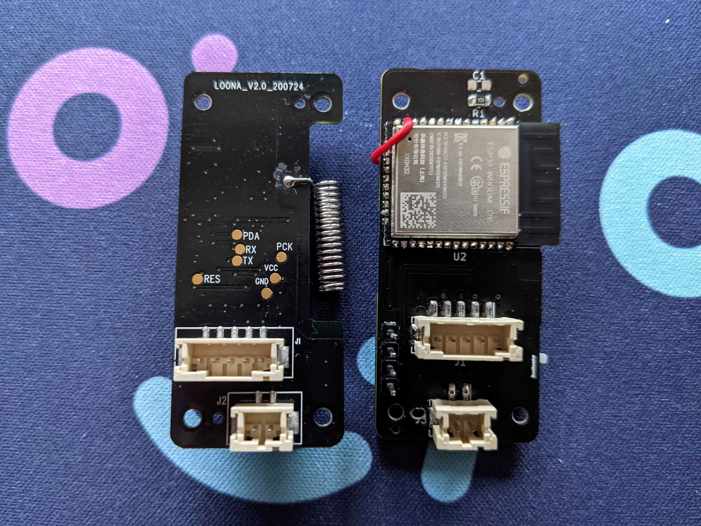

# Build log

## Step 0: reverse-engineering and PCB design

First, I needed to understand how the light stick originally works.
Disassembly was very easy (only standard screws, yay!) and the PCB had some labels, which helped a lot.
To recreate the important properties for my own PCB, I had to do a lot of measuring,
did a few voltage readings, and carefully studied the design of the board.  
With that out of the way, I could create the [PCB](pcb).
Finding the correct components wasn't trivial, and I spent a lot of time picking the right transistor to control the LEDs.
For the rest, I selected equivalent parts where applicable, and added appropriate components for new behavior.
A bit of layouting and routing later, everything seemed fine, and I had a flawless design to put into production.
*Or so I thought.* More on that later.

## Step 1: PCB assembly

…at least, partially.
Most components were already soldered by JLCPCB, since I chose to have one side of the board pre-assembled.
They did a very good job with it, in my opinion, just like on a previous order. It was also decently cheap.
Because I could only get one side assembled and them not having some parts, I needed to do the rest of the soldering myself.

 
Comparison of original PCB (left) with "fully" soldered replacement PCB (right) on both images, showing the front and back of it.

Unfortunately, it's already apparent here how many things I missed in my design (and that's not even all of them).
The pin I selected on the ESP32 didn't support wake up from deep sleep, so I had to add a wire to another pin and cut off the old trace.
Additionally, the screw holes weren't large enough, and I outright forgot one of the positioning holes
(see the drilled hole between the regulator U1 and the label of jumper J2).  
Talking about the regulator, it wasn't up to the required specs either:
The AMS-1117 I selected is great for use with USB power, but when employing it with a battery, the dropout of around 1 V is way too high.
Thus, I replaced it with a TPS73733 low-dropout regulator.
It has a different footprint, thus the solder job looks a bit *adventurous*.

 
<i>It's not pretty, I know…</i>

With that, the first part of the mod is already done!

## Step 2: fitting the battery

The stock light stick is powered with three AAA batteries.
However, the battery life of it isn't great and because I expect the ESP32 to draw way more power than the original MCU,
mostly due to added wireless connectivity, I decided to replace the battery as well.
Coincidentally, the diameter of the handle is just enough to fit a 21700 li-ion cell.
Thus, I decided to order the one with the biggest capacity I could find, while making sure it also included a battery protection circuit.
Really don't want my light stick to suddenly go up in flames.

To fit the battery inside the handle, I first had to disassemble it:

To make enough room for the battery, some parts of the reinforcement structures had to go.
Not gonna lie, using the rotary tool on the delicate plastics stressed me a bit, but thankfully, I didn't mess up anything.

With the battery in place, I could move forward to install the charging circuit and do the wiring.
For that, I used a MCP73871-based board that I first had to configure by (re-)placing some resistors and capacitors.
[This guide][1] helped me a lot in the process.
Additionally, since the board was a bit too wide by default, I had to cut off a slice from the PCB.
To attach the battery to the light stick head, I re-used the original battery enclosure,
but modified it to work with my design.

After some wire soldering, this part was done as well!

To charge the light stick, I added a USB-C port at the bottom lid.
I simply glued it into place and soldered wires onto it.

## Finished light stick

Finally, it is complete! Here is the reassembled light stick:

 
You don't see any difference from the outside, do you?

However, the hardware isn't the only part.
A custom [firmware](firmware) also needed to be written to actually introduce new features!

[1]: https://emariete.com/en/co2-meter-with-battery-well-done/#Modificando_la_placa_para_su_uso_con_cargadoralimentador_modificar_VPCC
